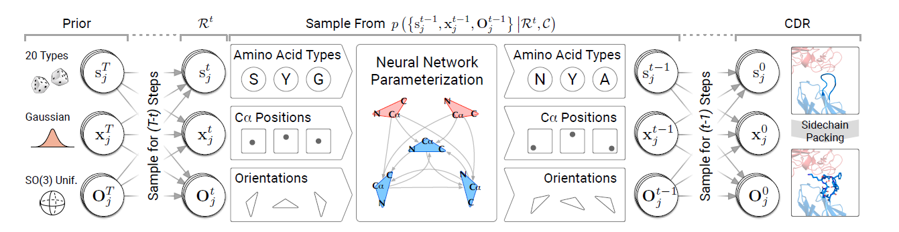

# diffab-pytorch (wip)

[](https://github.com/Lightning-AI/lightning)



An unofficial re-implementation of DiffAb, a diffusion-based generative model for antigen-specific antibody design and optimization.

## Installation

```bash
pip install diffab-pytorch
```

## Usage

```python
from diffab_pytorch import DiffAb

model = DiffAb()
```

## Data preprocessing

To train DiffAb, we need to extract local ***patches*** of antibody-antigen structures, which is defined as a set of ***K*** residues surrounding CDR anchor residues (Here, we use ***K=128***).
This repo provides handy script and pipeline to preprocess all the SAbDab structures. 
For now, the pipeline will work on Chothia-numbered PDB files only.
As a prerequisite, download SAbDab [all_structures.zip](https://opig.stats.ox.ac.uk/webapps/newsabdab/sabdab/archive/all/) files and extract it under `data` directory.
If it is done correctly, you will have a directory under the path `data/all_structures/chothia` with 7,599 PDB files (as of August 30, 2023).

Then, run the pipeline using `snakemake` command below. Replace `[CORES]` with appropriate number of CPU cores in your system.

*In case you don't have it already, install it with `pip install snakemake` or `conda install -c bioconda snakemake`*

```bash
$ snakemake -s pipelines/preprocess.smk -pr -j[CORES] --keep-going
```

`--keep-going` flag lets you ignore PDB files that are not able to preprocess for some reason (in most case PDB parser doesn't work with those files).
Let's see if dropping them will affect the reproduction performance later.

## Reproduction status

WIP

## Testing

```bash
$ pytest
``````

## Citation
```bibtex
@article{luo2022antigen,
  title={Antigen-specific antibody design and optimization with diffusion-based generative models for protein structures},
  author={Luo, Shitong and Su, Yufeng and Peng, Xingang and Wang, Sheng and Peng, Jian and Ma, Jianzhu},
  journal={Advances in Neural Information Processing Systems},
  volume={35},
  pages={9754--9767},
  year={2022}
}
```
